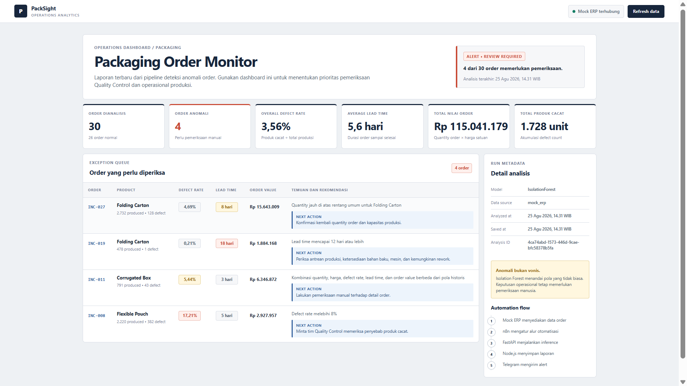
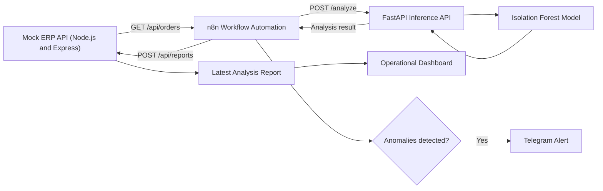
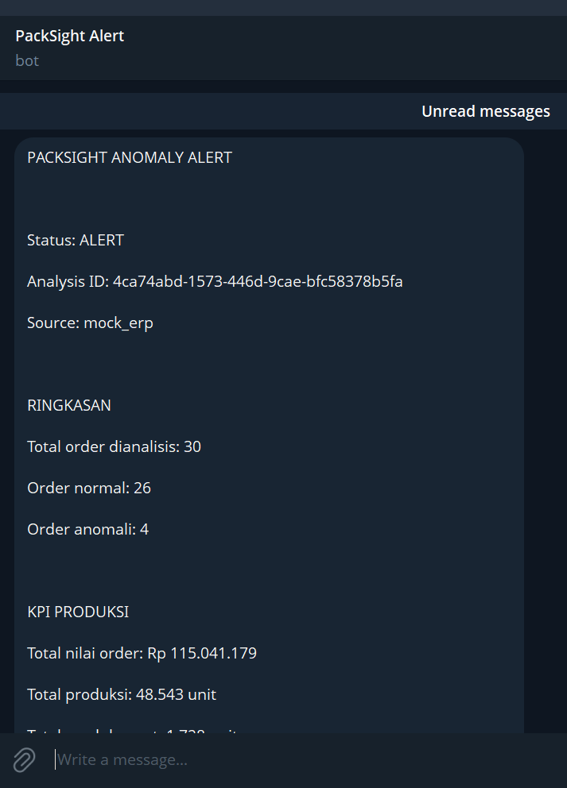

# PackSight Mini


An end-to-end packaging order anomaly detection system that combines data engineering, machine learning, workflow automation, operational reporting, and Telegram alerts.


PackSight Mini simulates how packaging order data can be collected from an ERP system, analyzed using an Isolation Forest model, orchestrated through n8n, and presented to operational teams through a monitoring dashboard.


## Dashboard Preview




## Project Overview


Packaging operations generate order data containing production quantity, defects, prices, and completion dates. Manually checking every order is inefficient and may cause unusual production patterns to be overlooked.


PackSight Mini automatically:


1\. Retrieves packaging orders from a mock ERP API.

2\. Sends the orders to a machine learning inference API.

3\. Calculates operational KPIs.

4\. Detects unusual orders using Isolation Forest.

5\. Saves the latest analysis report.

6\. Sends a Telegram alert when anomalies are detected.

7\. Displays the results in an operational dashboard.


The detected anomalies are review priorities, not automatic conclusions. Final operational decisions still require human verification.


## Architecture





## Main Features


\- Reproducible synthetic packaging-order dataset

\- Data validation and feature engineering

\- Isolation Forest anomaly detection

\- Model evaluation using injected anomaly labels

\- FastAPI machine learning inference service

\- Node.js and Express mock ERP API

\- n8n workflow orchestration

\- Conditional Telegram anomaly alerts

\- Operational KPI monitoring dashboard

\- Git and GitHub version-control workflow

\- No Docker required


## Technology Stack


| Technology | Purpose |

|---|---|

| Python | Data generation, data processing, model training, and inference |

| pandas | Tabular data transformation and KPI calculation |

| scikit-learn | Isolation Forest model and evaluation metrics |

| FastAPI | Machine learning inference API |

| Uvicorn | Local ASGI server for FastAPI |

| Node.js | JavaScript runtime for the mock ERP service |

| Express | Mock ERP API, report storage, and dashboard server |

| n8n | Workflow orchestration and scheduling |

| Telegram Bot API | Operational anomaly notification |

| HTML, CSS, JavaScript | Monitoring dashboard |

| Git and GitHub | Source control and portfolio documentation |


## Operational Definitions


| Term | Definition |

|---|---|

| Lead time | Number of days between the order date and completion date |

| Defect count | Number of produced units that do not meet quality requirements |

| Defect rate | Defect count divided by produced quantity, expressed as a percentage |

| Order value | Ordered quantity multiplied by unit price |

| Anomaly | An order whose feature combination differs from historical patterns |

| Inference | Using a trained model to analyze new data |

| False positive | A normal order incorrectly flagged as anomalous |

| False negative | An actual anomaly that the model fails to detect |


### KPI Formulas


```text

Defect rate = defect count / produced quantity × 100%


Lead time = completed date - order date


Order value = ordered quantity × unit price

```


## Dataset


The project uses deterministic synthetic data so that it can be reproduced without exposing confidential company information.


### Historical dataset


\- 500 packaging orders

\- 25 injected anomalies

\- Used for model training and evaluation

\- Stored in `data/historical\_orders.csv`


### Incoming dataset


\- 30 packaging orders

\- Used to simulate new ERP records

\- Stored in `data/incoming\_orders.json`


The mock ERP API removes the `is\_injected\_anomaly` field before returning incoming orders. This prevents the inference service from seeing the expected answer and avoids target leakage.


### Main Data Fields


| Field | Description |

|---|---|

| `order\_id` | Unique order identifier |

| `order\_date` | Date the order was received |

| `completed\_date` | Date production was completed |

| `product\_type` | Packaging product category |

| `ordered\_quantity` | Quantity requested by the customer |

| `produced\_quantity` | Total quantity produced |

| `defect\_count` | Number of defective units |

| `unit\_price` | Price per unit |

| `is\_injected\_anomaly` | Synthetic label used only for evaluation |


## Machine Learning


### Model


The project uses `IsolationForest`, an unsupervised anomaly-detection algorithm.


Isolation Forest attempts to isolate observations using random decision trees. Unusual observations generally require fewer splits to isolate, producing a more anomalous score.


The model does not require anomaly labels during training. Synthetic labels are used only to evaluate whether the generated anomalies can be detected.


### Model Features


Numeric features:


\- `ordered\_quantity`

\- `unit\_price`

\- `defect\_rate`

\- `lead\_time\_days`

\- `order\_value`


Categorical feature:


\- `product\_type`


### Configuration


| Parameter | Value |

|---|---:|

| Training records | 400 |

| Testing records | 100 |

| Test size | 20% |

| Contamination | 5% |

| Number of estimators | 100 |

| Random seed | 42 |


### Evaluation Results


| Metric | Result |

|---|---:|

| Precision | 0.6667 |

| Recall | 0.8000 |

| F1 score | 0.7273 |

| True negative | 93 |

| False positive | 2 |

| False negative | 1 |

| True positive | 4 |


Interpretation:


\- The model detected 4 of the 5 injected anomalies in the test data.

\- Recall of `0.80` means 80% of known test anomalies were detected.

\- Precision of `0.6667` indicates that some detected anomalies were false positives.

\- The model is intended to prioritize manual review, not make final operational decisions.


## Workflow Automation


The n8n workflow performs the following sequence:


1\. Starts manually or from a daily schedule.

2\. Retrieves orders from the mock ERP API.

3\. Sends the order payload to the FastAPI inference endpoint.

4\. Saves the analysis result through the Express API.

5\. Checks whether `anomaly\_count` is greater than zero.

6\. Sends a Telegram notification through the true branch.

### Telegram Alert Preview

The Telegram notification provides operational context, anomaly indicators, and recommended follow-up actions for manual review.




Workflow export:


```text

workflows/packsight-anomaly-alert.json

```


Telegram credentials are stored inside n8n and are not included in the exported workflow. The exported Chat ID is replaced with a placeholder.


## API Endpoints


### FastAPI inference service


Default URL:


```text

http://127.0.0.1:8000

```


| Method | Endpoint | Purpose |

|---|---|---|

| GET | `/` | Service information |

| GET | `/health` | Service health check |

| POST | `/analyze` | Validate orders, run inference, and calculate KPIs |

| GET | `/docs` | Interactive FastAPI documentation |


### Mock ERP and dashboard service


Default URL:


```text

http://127.0.0.1:3000

```


| Method | Endpoint | Purpose |

|---|---|---|

| GET | `/` | Operational dashboard |

| GET | `/health` | Service health check |

| GET | `/api` | API endpoint information |

| GET | `/api/orders` | Retrieve incoming packaging orders |

| POST | `/api/reports` | Save an analysis report |

| GET | `/api/reports/latest` | Retrieve the latest report |


## Local Setup


### Prerequisites


\- Python 3.12

\- Node.js 20 or newer

\- npm

\- Git

\- n8n 2.x

\- Telegram account for optional notifications


### 1. Clone the repository


```powershell

git clone https://github.com/Croft2BMax/packsight-mini.git

cd packsight-mini

```


### 2. Create the Python virtual environment


```powershell

py -3.12 -m venv .venv

```


If PowerShell blocks script activation:


```powershell

Set-ExecutionPolicy -Scope Process -ExecutionPolicy RemoteSigned

```


Activate the environment:


```powershell

.\\.venv\\Scripts\\Activate.ps1

```


Install Python dependencies:


```powershell

python -m pip install -r requirements.txt

```


### 3. Generate the datasets


```powershell

python analytics\\generate\_data.py

```


### 4. Train and evaluate the model


```powershell

python analytics\\train.py

```


This creates the local model artifact:


```text

artifacts/isolation\_forest.joblib

```


### 5. Install Node.js dependencies


```powershell

npm install

```


### 6. Start the FastAPI service


Open terminal 1:


```powershell

python -m uvicorn analytics.main:app --reload --port 8000

```


### 7. Start the mock ERP and dashboard


Open terminal 2:


```powershell

npm run dev

```


Dashboard:


```text

http://127.0.0.1:3000

```


### 8. Start n8n


Open terminal 3:


```powershell

$env:GENERIC\_TIMEZONE = "Asia/Jakarta"

npx n8n@2

```


n8n editor:


```text

http://127.0.0.1:5678

```


Import `workflows/packsight-anomaly-alert.json`, configure the Telegram credential and Chat ID, then execute or publish the workflow.


## Project Structure


```text

packsight-mini/

├── analytics/

│   ├── \_\_init\_\_.py

│   ├── generate\_data.py

│   ├── main.py

│   └── train.py

├── api/

│   └── server.js

├── artifacts/

│   └── metrics.json

├── data/

│   ├── historical\_orders.csv

│   └── incoming\_orders.json

├── docs/

├── public/

│   ├── app.js

│   ├── index.html

│   └── styles.css

├── workflows/

│   └── packsight-anomaly-alert.json

├── .gitignore

├── package.json

├── package-lock.json

├── requirements.txt

└── README.md

```


## Security Considerations


\- Telegram bot tokens must never be committed to Git.

\- Telegram credentials are stored in n8n's credential manager.

\- The workflow export uses a placeholder for the Telegram Chat ID.

\- The model artifact is generated locally and excluded from Git.

\- The latest runtime report is excluded from Git.

\- The APIs currently run without authentication because this is a local portfolio project.


## Current Limitations


\- The dataset is synthetic and does not represent real company records.

\- Isolation Forest identifies unusual patterns but does not prove the root cause.

\- Report storage currently uses a local JSON file instead of a production database.

\- The services do not yet implement authentication or authorization.

\- The current architecture is intended for local demonstration, not production deployment.

\- Human review is still required before taking operational action.


## Possible Improvements


\- Replace synthetic data with anonymized production data

\- Add PostgreSQL for historical reports

\- Add API authentication and role-based access control

\- Add model and data-drift monitoring

\- Add automated unit and integration tests

\- Add CI checks through GitHub Actions

\- Add historical trend charts

\- Containerize services for production deployment

\- Deploy the APIs and dashboard to a cloud platform


## Portfolio Highlights


This project demonstrates:


\- Data collection and transformation

\- Operational KPI calculation

\- Feature engineering

\- Unsupervised machine learning

\- Model evaluation

\- REST API development

\- JavaScript and Python service integration

\- Workflow automation with n8n

\- Conditional Telegram notifications

\- Dashboard development

\- Git and GitHub practices

\- Security awareness and documentation


## Disclaimer


PackSight Mini is an educational portfolio project. All order records are synthetic, and anomaly results should not be treated as production decisions without additional validation.

